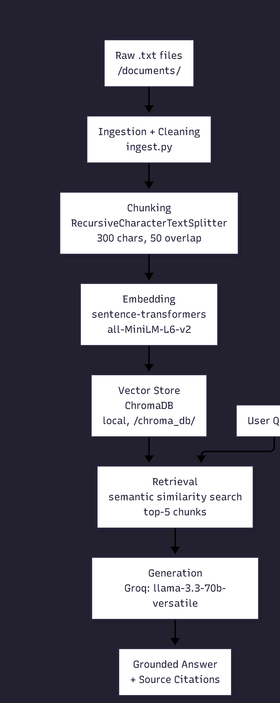

# Project 1 Planning: The Unofficial Guide

> Write this document before you write any pipeline code.
> Your spec and architecture diagram are what you'll use to direct AI tools (Claude, Copilot, etc.) to generate your implementation — the more specific they are, the more useful the generated code will be.
> Update the Retrieval Approach and Chunking Strategy sections if you change your approach during implementation.
> Update this file before starting any stretch features.

---

## Domain

<!-- What domain did you choose? Why is this knowledge valuable and hard to find through official channels? -->
I chose CS professor reviews at University of Delaware as my domain. 
This knowledge is valuable because students make critical course decisions 
based on teaching quality, exam style, and workload. Official university 
sources (course catalogs, department websites) contain none of this. 
The only way to get it is through student-to-student communication on platforms 
like Rate My Professors and university subreddits, which are scattered and 
unsearchable in aggregate.
---

## Documents

<!-- List your specific sources: URLs, subreddit names, forum threads, or file descriptions.
     Aim for at least 10 sources that together cover different subtopics or perspectives within your domain. -->

| # | Source | Description | URL or location |
|---|--------|-------------|-----------------|
| 1 | Greg Silber.txt  :Rate my professor reviews for prof Greg Silber; URL: https://www.ratemyprofessors.com/professor/58559
| 2 | Katherine Wassil.txt  :Rate my professor reviews for prof Katherine Wassil; URL:https://www.ratemyprofessors.com/professor/238767
| 3 | John Aromando.txt  :Rate my professor reviews for prof John Aromando; URL: https://www.ratemyprofessors.com/professor/2826749
| 4 | Matthew Saponaro.txt  :Rate my professor reviews for prof Matthew Saponaro; URL: https://www.ratemyprofessors.com/professor/2111684
| 5 | Nazim Karaca.txt  :Rate my professor reviews for prof Nazim Karaca; URL: https://www.ratemyprofessors.com/professor/2701414
| 6 | Adarsh Sethi.txt  :Rate my professor reviews for prof Adarsh Sethi; URL: https://www.ratemyprofessors.com/professor/48222
| 7 | Keith Decker.txt  :Rate my professor reviews for prof Keith Decker; URL: https://www.ratemyprofessors.com/professor/540363
| 8 | Austin Bart.txt  :Rate my professor reviews for prof Austin Bart; URL: https://www.ratemyprofessors.com/professor/2402842
| 9 | Andrew Roosen.txt  :Rate my professor reviews for prof Andrew Roosen; URL: https://www.ratemyprofessors.com/professor/1701222
| 10 |Christopher Rasmussen.txt  :Rate my professor reviews for prof Christopher Rasmusse; URL: https://www.ratemyprofessors.com/professor/215477

Together these sources cover: teaching quality, exam formats, grading curves, attendance policies, and course difficulty across the CS department.
---

## Chunking Strategy

<!-- How will you split documents into chunks?
     State your chunk size (in tokens or characters), overlap size, and explain why those
     numbers fit the structure of your documents.
     A review-heavy corpus warrants different chunking than a long FAQ. -->

My documents are primarily short student reviews (2–5 sentences each), not long-form guides. Because individual reviews are already self-contained units of opinion, I will:

**Chunk size:** 300 characters

**Overlap:** 50 characters

**Reasoning:**
**Why these numbers:** Each review is typically 150–400 characters. At 300  characters, most individual reviews fit within a single chunk, preserving the complete thought. Overlap at 50 characters ensures that if a key sentence falls at a boundary, it still appears in both adjacent chunks so retrieval can find it. Larger chunks (800+) would merge unrelated reviews together, making retrieval return unfocused, multi-opinion chunks instead of specific ones.

**How I'd know chunks are too small:** Retrieval returns fragments like "exams are curved" with no surrounding context about which professor or course.
**How I'd know chunks are too large:** Every query returns the same giant chunk covering 10 different professors.
---

## Retrieval Approach

<!-- Which embedding model are you using (e.g., all-MiniLM-L6-v2 via sentence-transformers)?
     How many chunks will you retrieve per query (top-k)?
     If you were deploying this for real users and cost wasn't a constraint, what tradeoffs
     would you weigh in choosing a different embedding model — context length, multilingual
     support, accuracy on domain-specific text, latency? -->

**Embedding model:** all-MiniLM-L6-v2 (via sentence-transformers, runs locally). It runs entirely locally with no API costs or rate 
limits, produces 384-dimensional embeddings that work well for short opinion 
text, and has fast inference suitable for a development project.

**Top-k:** 5 chunks per query. Retrieving 5 chunks gives the LLM enough context to synthesize a complete answer without including so many chunks that loosely-related content drowns out the relevant ones.

**Production tradeoff reflection:**
- Context length: all-MiniLM-L6-v2 has a 256-token max; for longer documents 
  I'd consider text-embedding-3-small (OpenAI) which supports 8191 tokens.
- Multilingual support: If students write reviews in other languages, 
  I'd switch to paraphrase-multilingual-MiniLM-L12-v2.
- Accuracy on domain-specific text: A fine-tuned model on academic review 
  text would outperform general-purpose embeddings.
- Cost: Local models have no per-call cost; OpenAI's API costs ~$0.02/1M tokens.
- Latency: Local models add ~50ms on CPU; API models add network roundtrip.
---

## Evaluation Plan

<!-- List your 5 test questions with their expected correct answers.
     Questions should be specific enough that you can judge whether the system's response
     is right or wrong. "What are good dining halls?" is too vague.
     "What do students say about wait times at [dining hall name] during lunch?" is testable. -->

| # | Question | Expected answer |
|---|----------|-----------------|
| 1 |Q: What do students say about Prof. Sethi's attendance policy and lecture slides?
     Expected: Students strongly recommend attending class even though Sethi posts his annotated slides and lecture videos online, because he adds extra information during class that is not captured in the slides. There are also in-class assignments that count toward your grade, making attendance important.
| 2 |Q: What do students say about Prof. Roosen's lectures and how to succeed in his class?
     Expected: Students say Roosen's lectures can be tangential and feel loaded with unnecessary information, and that most learning comes from the assigned readings (Perusalls). To succeed, students recommend doing the readings, attending class, starting projects early, and staying on top of assignments.
| 3 |Q; What do students say about asking Prof. Bart questions in class or office hours?
     Expected: Students consistently report that Prof. Bart is condescending and dismissive when asked questions, making the classroom feel intimidating. Most students recommend going to the TAs instead for actual help.
| 4 |Q:  Wassil's class self-taught or does she teach during lectures?
     Expected: Mostly self-taught. Multiple students say lectures are not very helpful and that most learning happens through homework and online materials outside of class. However, Wassil herself is very accessible, kind, and willing to help during office hours.
| 5 |Q; What is Prof. Silber's workload and grading style like?
     Expected: Workload is light typically 2 exams, a few programming projects, and some homework graded on effort rather than correctness. Silber allows cheat sheets on exams and is known to round up grades. Students say it is manageable even with minimal prior experience.
---

## Anticipated Challenges

<!-- What could go wrong? Name at least two specific risks with reasoning.
     Consider: noisy or inconsistent documents, missing source attribution, off-topic
     retrieval, chunks that split key information across boundaries. -->

1.Chunk boundary splits: A review's key claim (e.g., "exams are curved") might appear at the end of one chunk and beginning of the next, so neither chunk alone contains the full context. Overlap mitigates this but doesn't eliminate it.

2.Professor name disambiguation:Two professors with similar names, or reviews that use nicknames ("Prof. J" instead of "John"), may confuse retrieval. The query "Prof. John" might pull results about a different professor whose review shares other similar words.

---

## Architecture

<!-- Draw a diagram of your pipeline showing the five stages:
     Document Ingestion → Chunking → Embedding + Vector Store → Retrieval → Generation
     Label each stage with the tool or library you're using.
     You can use ASCII art, a Mermaid diagram, or embed a sketch as an image.
     You'll use this diagram as context when prompting AI tools to implement each stage. -->
 
---

## AI Tool Plan

<!-- For each part of the pipeline below, describe:
     - Which AI tool you plan to use (Claude, Copilot, ChatGPT, etc.)
     - What you'll give it as input (which sections of this planning.md, which requirements)
     - What you expect it to produce
     - How you'll verify the output matches your spec

     "I'll use AI to help me code" is not a plan.
     "I'll give Claude my Chunking Strategy section and ask it to implement chunk_text()
     with my specified chunk size and overlap" is a plan. -->

**Milestone 3 — Ingestion and chunking:**  I will share my Documents section and Chunking Strategy section and ask Claude to implement a script that loads .txt files from /documents, cleans them (strips blank lines and extra whitespace), and chunks them using my specified size (300 chars) and overlap (50 chars).

**Milestone 4 — Embedding and retrieval:** I will share my Retrieval Approach section and pipeline diagram and ask Claude to implement the embedding step using sentence-transformers and ChromaDB storage with source metadata.

**Milestone 5 — Generation and interface:** I will ask Claude to write the system prompt that enforces grounding (answer only from context) and source attribution.

